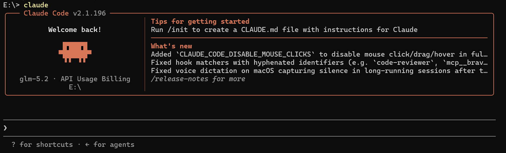
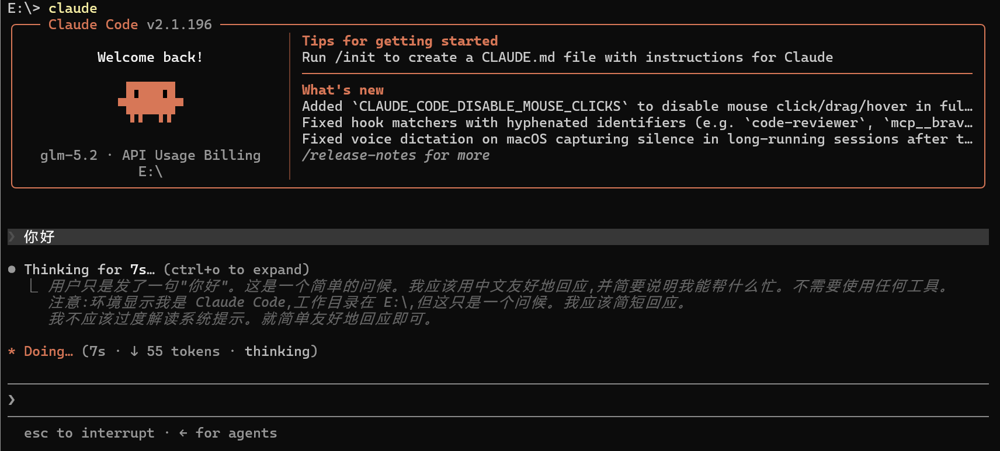
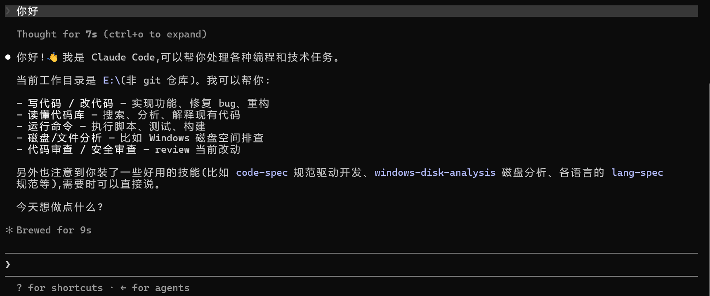

# smcode TUI 界面优化 Spec

## 背景

当前 smcode 的终端界面（`src/tui`）已完成多 Provider 切换与流式对话功能，但视觉表现较为基础：消息区仅有简单的标签与文本，输入框为全边框圆角样式，缺乏欢迎页与状态反馈。用户希望参考 Claude Code 的终端界面风格，对 smcode 进行整体视觉升级，使其在首次启动、处理中、返回结果三种状态下都具有更专业、更一致的交互体验。

## 目标

- 实现 Claude Code 风格的欢迎页（圆角边框大卡片），作为常驻顶部品牌区展示 Welcome back、Clawd 吉祥物、模型·Provider、当前目录、入门提示与更新动态。
- 重构消息区视觉：用户消息采用深色气泡 + 提示符，助手消息采用左缩进 + 圆点标识，思考过程支持可折叠展示。
- 重构底部输入框：采用仅底部圆角边框、左侧提示符、右侧快捷提示的样式。
- 增加处理中状态指示：包含思考时间、token 消耗、当前动作等动态信息。
- 保持现有功能（多 Provider 选择、流式输出、token 统计）不受影响。

## 效果参考

本次优化参考 Claude Code 的以下三种界面状态：

- 初始界面：

  

- 处理中：

  

- 返回结果：

  

上述「处理中」状态行的动态效果（图标形态脉冲、动词变化、卡顿变红、思考状态切换等）的源码级机制梳理见 [`claudecode-tui.md`](./claudecode-tui.md)，作为本章 `StatusIndicator` 组件的设计依据。本章在原 F8「处理中状态」的基础上，将其扩展为一组动态提示图标需求（F8–F8e）。

## 功能需求

- F1 欢迎页常驻顶部：欢迎页（圆角边框大卡片 + borderText 标题 `smcode vX.X.X`，含 Welcome back、Clawd、模型·Provider、当前目录、Tips、What's new）作为顶部品牌区**常驻显示**，不随对话消失。删除原顶部独立的 smcode 标题栏；**消息区不再使用外层边框**（消除与欢迎页的双重边框）。
- F2 欢迎页左侧信息区（对齐 Claude Code LogoV2）：圆角边框顶部以 borderText 渲染标题 `smcode vX.X.X`（品牌橙 + 版本灰，版本号运行时从 `package.json` 的 `version` 字段读取）；左侧自上而下展示「Welcome back!」欢迎语、Clawd 吉祥物（9×3 ASCII 方块小兽）、`{model} · {provider}`、当前工作目录。
- F3 欢迎页右侧分区与分隔：左右栏之间以橙色竖线（borderDimColor）分隔；右侧上下分栏两个 Feed，上方「Tips for getting started」入门提示、下方「What's new」更新动态，标题品牌橙加粗、条目前缀 `·` 暗灰。
- F4 欢迎页内容来源：入门提示与更新动态内容可硬编码在组件/常量文件中，本次不做外部配置化或网络拉取。
- F5 消息气泡 - 用户：用户消息使用深色背景气泡（背景色**铺满终端整行**），左侧 `❯` 提示符（`figures.pointer`，U+276F，**中性灰 `subtle`、不染橙**）与助手消息 `●` 圆点、完成态 `✻` 图标**左对齐**（同一列），文本显示完整的用户输入。
- F6 消息气泡 - 助手：助手消息左侧带 `●` 圆点标识（`BLACK_CIRCLE`，U+25CF，**亮前景 `text`、不染橙**），文本使用 Markdown 渲染；代码块、列表保持可读性。轮次结束的完成态行（`✻ Brewed for Xs`，`✻` 为 `TEARDROP_ASTERISK` U+273B，**中性 dim 色、不染橙**）的 ✻ 图标与 `●` 圆点**左对齐**（同一左边界，不缩进到内容区）。
- F6z 三图标垂直对齐：用户消息 `❯`、助手消息 `●`、完成态 `✻`（以及处理中脉冲星号）必须落在**同一垂直列**，形成一条左边缘齐平的"装订线"。实现上三者各自放进一个**固定 2 字符宽的边沟**（字符占 1 格 + 1 格空格留白，可用 `width={2}`/`minWidth={2}` 或等价的 `"❯ "`/`"● "`/`"✻ "` 字面量），行结构统一为 `Box flexDirection="row" alignItems="flex-start"`，内容区从第 2 列起。三个字符常量集中定义（如 `constants/figures.ts`）。机制依据见 `claudecode-tui.md` 附录 D。
- F7 思考过程展示：助手思考过程默认折叠，显示 `Thinking for Xs (ctrl+o to expand)` 提示（**前缀以空格占位、不显示 `∴`**）；展开后以 `∴` 为前缀显示完整思考文本。**思考提示独立成行、渲染在助手 `●` 圆点行之前；前缀（`∴` 或占位空格）顶格，与下方 `●` 圆点左对齐（同一列），思考提示前不再重复 `●` 圆点。**
- F8 处理中动态提示行：模型响应期间在消息列表底部显示一条动态提示行，结构为「动态图标 + 动词…（耗时 · token 数 · thinking）」，整体参考 Claude Code 的处理中视觉，机制依据见 `claudecode-tui.md`。
- F8a 图标形态脉冲：提示行左侧的图标使用一组视觉权重递增的字符（如 `· ✢ ✳ ✶ ✻ ✽`）按帧循环切换，形成由小到大、再回缩的呼吸效果，而非一个静止符号。
- F8b 动词选取与显示：动词来自一个花式动词池，每次对话开始时随机选取一个并在本轮保持不变；助手正在执行任务时，动词可被该任务的进行式描述覆盖；一轮结束后动词切换为对应的完成式（如 `✻ Brewed for Xs`，`✻` 为静态 `TEARDROP_ASTERISK`，与处理中的脉冲星号线是两种状态，切换时图标列不变）。
- F8c 思考状态切换：助手思考期间，括号内显示 `thinking`；思考结束后切换为 `thought for Xs`，并停留一段最短时间（约 2 秒）后再消失，避免状态一闪而过。
- F8d 卡顿变红：当响应内容停滞超过设定阈值（如数秒无新内容）时，图标与动词文本的颜色从主色平滑过渡到红色，提示响应可能卡住；恢复输出后回到主色。
- F8e 宽度自适应：提示行各段（thinking / 耗时 / token）按终端宽度逐级降级显示，窄终端下优先保留图标与动词，避免换行或撑爆。
- F9 底部输入框：输入框采用**上下两条灰白边界线**（`borderTop` + `borderBottom`，single 样式，`theme.dim`），左侧显示 `❯` 提示符，占位符提示输入内容。
- F10 底部快捷提示：输入框下方左侧显示当前可用快捷键（如 `? for shortcuts`、`esc to interrupt`），右侧显示发送/等待状态。
- F11 滚动与布局：欢迎页固定顶部；主聊天区在其下方支持滚动；输入框固定底部。
- F12 主题与颜色：使用 Claude Code 风格的暗色主题，主色调为橙/珊瑚色（与截图一致），用户消息为灰/深色气泡，助手标识为白色/亮色。

## 非功能需求

- N1 性能：欢迎页与消息区渲染不应引入明显性能退化；继续使用 `memo` 与稳定 key 减少重渲染。
- N2 兼容性：保持 smink 组件库的使用方式，不引入新的终端渲染引擎或外部 UI 依赖。
- N3 可维护性：将欢迎页、消息气泡、输入框、状态行拆分为独立组件，便于后续迭代。
- N4 可访问性：保持 Ctrl+C 退出、Enter 发送、方向键滚动等现有快捷键行为不变。
- N5 终端适配：界面在 80×24 及以上的常见终端尺寸下布局不崩坏；内容过长时正确截断或换行。

## 不做的事

- 不替换 smink 作为底层终端渲染库，也不在项目内自研终端渲染引擎。
- 不实现鼠标点击、选区高亮、 hyperlink 支持等 Claude Code 的高级终端交互。
- 不实现真正的 Markdown 表格渲染与语法高亮，仅对纯文本、列表、代码块做基础样式区分。
- 不实现多语言国际化，界面文案保持中文或中英混合，与现有风格一致。
- 不修改 Provider 选择界面的核心逻辑，仅在主题色上保持一致。
- 不实现从网络动态拉取「What's new」内容，首次实现采用硬编码文本。
- 不使用备用屏幕（alt screen）或退出清屏机制；TUI 渲染在主屏幕，Ctrl+C 退出后对话内容会保留在终端滚动历史中，不输出 `Resume this session with:` 提示。

## 验收标准

- AC1 启动即见欢迎页：启动 smcode 即在顶部显示圆角边框欢迎卡（borderText 标题 `smcode vX.X.X`；左侧 Welcome back/Clawd/模型·Provider/当前目录，右侧 Tips 与 What's new）。
- AC2 欢迎页信息完整：顶部边框标题 `smcode vX.X.X`；左侧含「Welcome back!」、Clawd 吉祥物、`{model} · {provider}`、当前目录；左右栏有橙色竖线分隔；右侧含「Tips for getting started」与「What's new」两个 Feed。
- AC3 对话与欢迎页并存：发送消息后欢迎页仍常驻顶部，消息列表在其下方显示用户消息气泡与助手回复。
- AC4 用户消息样式：用户消息呈现深色背景气泡，左侧带 `❯` 提示符，文本完整可见。
- AC5 助手消息样式：助手消息左侧带 `●` 圆点标识，支持 Markdown 基础渲染（列表、代码块）。
- AC5a 三图标同列对齐：用户消息 `❯`、助手消息 `●`、完成态 `✻` 落在同一垂直列（左边缘齐平）；三者均为中性灰/白色，不染品牌橙；各自占用固定 2 字符宽边沟，内容区从第 2 列起。
- AC6 思考过程展示：助手思考时默认显示 `Thinking for Xs (ctrl+o to expand)` 提示（**空格占位、无 `∴`**），按 ctrl+o 可展开/折叠思考文本；该提示行独立成行、渲染在 `●` 圆点行之前，前缀与 `●` 左对齐（同一列）、提示前无 `●` 圆点。
- AC7 处理中动态提示行：模型响应期间显示「动态图标 + 动词 + 状态括号」的提示行，括号内按宽度显示耗时、token 数与 thinking；其左侧脉冲星号也位于 `❯`/`●`/`✻` 同一列（同样使用 2 字符固定边沟）。
- AC7a 图标呼吸：提示行左侧图标字符随时间循环切换，肉眼可见从小到大再回缩的脉冲效果，而非静止符号。
- AC7b 动词生效：不同对话轮次可见不同的动词；助手执行任务时动词可反映任务进行式；轮次结束后出现完成式（如 `Brewed for Xs`）。
- AC7c 思考状态切换：思考时括号内可见 `thinking`，结束后可见 `thought for Xs`，且不会因思考时长过短而一闪而过。
- AC7d 卡顿变红：人为让响应停滞数秒，可见图标与动词文本逐渐变红；恢复输出后颜色回到主色。
- AC8 底部输入框样式：输入框为仅底部圆角边框，左侧显示 `❯` 提示符，等待回复时边框变暗并显示等待占位符。
- AC9 底部快捷提示：输入框下方显示快捷键提示（如 `Enter 发送`、`esc to interrupt` 等）。
- AC10 现有功能无回归：多 Provider 选择、流式输出、token 统计、Ctrl+C 退出、Enter 发送等功能保持正常。
- AC11 编译通过：运行 `npm run build` 无 TypeScript 编译错误。
